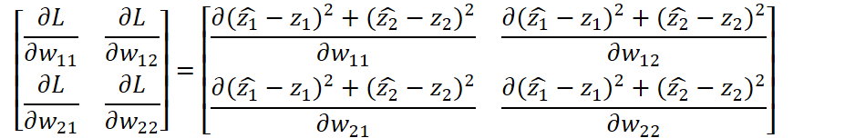

# Neural Network from scratch

## 1. Propagation
   
- With one batch
  - The first layer   
  
  - The second layer   
    

- 2 size batch
  - The first layer  
  
  - The second layer  
  

    

## 2. Backpropagation

Equation for updating weights  
  (Alpha is Learning rate.)  

The Equation for the first layer can be expressed the following.  
    

### For updating the second layer, the matrix bellow need to be computed.
  
where L is Loss, z^hat is the answer and the loss function is MSE. 

what we need is simply computed by calculating  **transpose(INPUT) * LOSS**

### For the first layer
  

we will see the first row, first column element.

the other elements is computed respectively.

### The conclusion is that we can update weights with input, output and loss matrix.